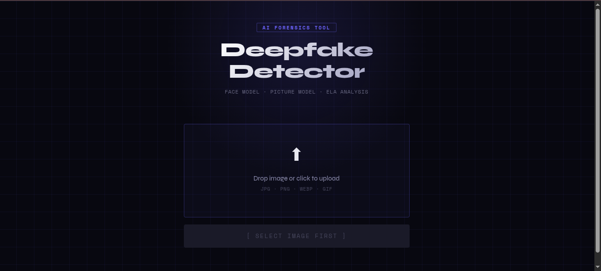
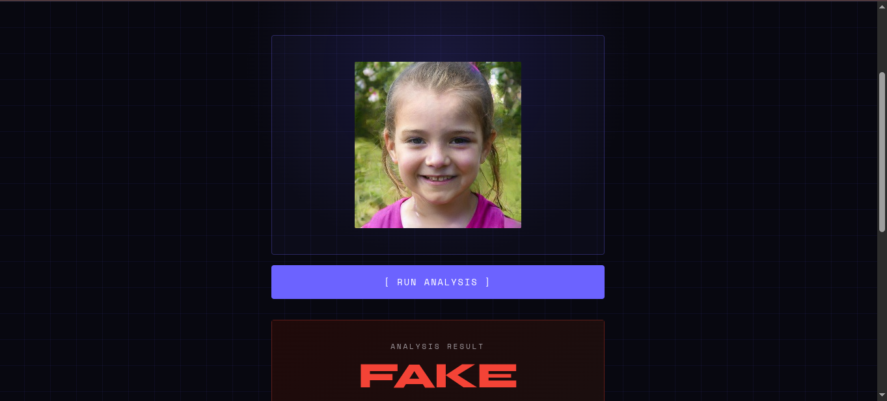
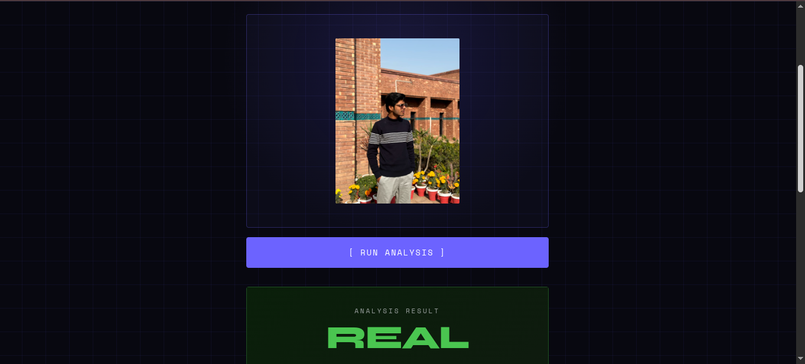

<div align="center">

# 🛡️ Deepfake-image-Detector
### Professional AI Forgery Detection System

[]()
[]()
[]()
[]()
[]()
[]()
[]()

*Advanced image forensics using Hybrid EfficientNet-B0 and Error Level Analysis (ELA)*

---

## 📸 Results Showcase

<table>
  <tr>
    <td></td>
    <td></td>
    <td></td>
  </tr>
</table>

</div>

---

## 🌟 Features

- **Hybrid AI Engine**: Combines deep learning (EfficientNet-B0) with classical forensics (ELA) for maximum accuracy.
- **Face-Centric Detection**: Automatically detects, crops, and analyzes faces to identify subtle GAN/Diffusion artifacts.
- **Digital Forensics (ELA)**: Built-in Error Level Analysis to detect inconsistencies in JPEG compression levels across the image.
- **Real-Time Analysis**: High-performance FastAPI backend providing instant results with detailed confidence scores.
- **Modern React Interface**: Clean, intuitive UI for uploading images and viewing comprehensive analysis reports.

## 🛠 Tech Stack

| Layer | Technologies Used |
|-------|-------------------|
| **Frontend** | React 19, CSS3, JavaScript (ES6+) |
| **Backend** | FastAPI, Python 3.10, Uvicorn |
| **Machine Learning** | PyTorch, Torchvision, EfficientNet-B0 |
| **Computer Vision** | OpenCV (Haar Cascades), Pillow (ELA Analysis) |

## 🚀 Quick Start

### 1. Prerequisites
*   **Python**: >= 3.10
*   **Node.js**: >= 18.0
*   **Virtual Environment**: Recommended (venv)

### 2. Environment Setup
The project includes an automated script to launch both the backend and frontend simultaneously.

```bash
# Give execution permission to the script
chmod +x scripts/start.sh

# Run the full application
./scripts/start.sh
```

## 🧰 The Analysis Toolset

- **AI Verdict**: Categorizes images as **REAL**, **FAKE**, or **UNCERTAIN** based on multi-model consensus.
- **Face Detection**: Uses OpenCV cascades to isolate subjects for targeted deep learning inference.
- **Forensic ELA**: Analyzes resave-differences to find areas of an image that have been digitally altered.
- **Weighted Scoring**: 
  - **Face Model (60%)**: Highest weight for facial features.
  - **Global Picture Model (25%)**: Analyzes scene consistency.
  - **ELA Score (15%)**: Validates digital integrity.

## 🧠 Machine Learning Details

Deepfake-image-Detector features a dual-stage pipeline optimized for accuracy and speed.
- **Architecture**: EfficientNet-B0 backbone with custom classification heads.
- **Performance**: 
  - **Face Model**: 88% Accuracy
  - **Picture Model**: 92% Accuracy
- **Input Resolution**: 224x224 (Standardized for EfficientNet).
- **Dual Pipeline**: Runs parallel inference on full images and cropped face regions to catch both global and local inconsistencies.

## 🤝 Contributing
Contributions are welcome! Please ensure that any ML changes are verified against the validation set and new frontend features maintain the responsive, forensic-focused design language.

## 📜 License
MIT License. See `LICENSE` for details.
